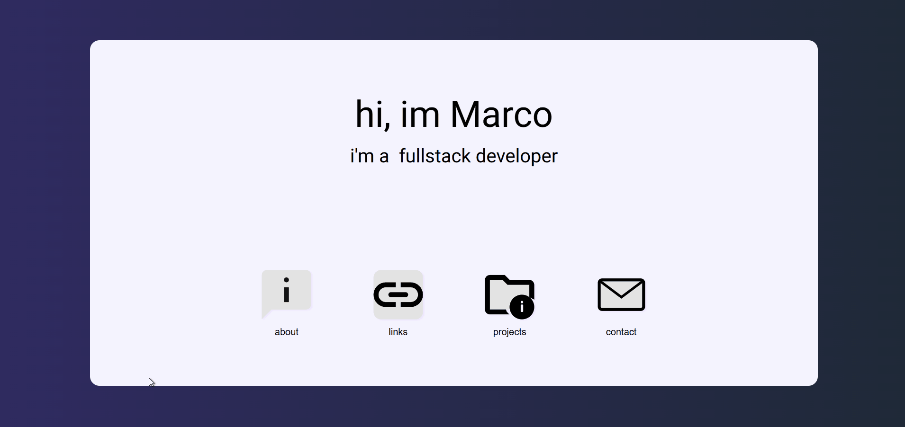
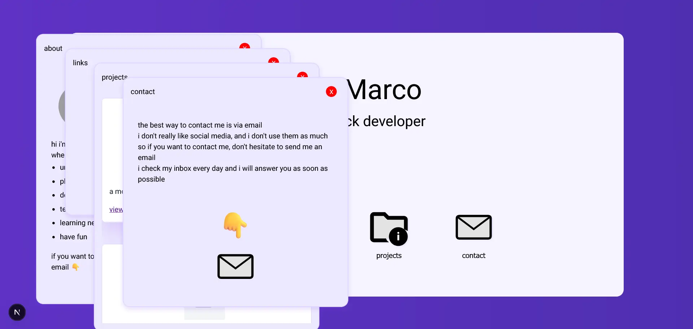
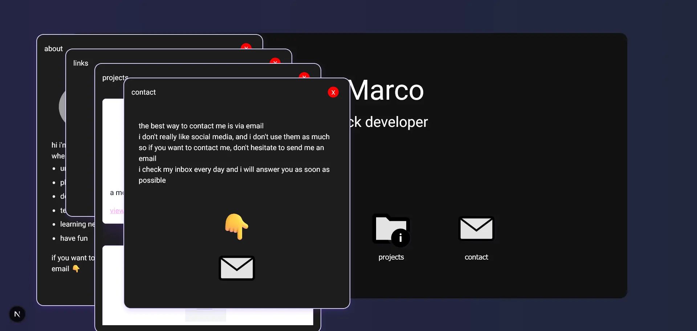
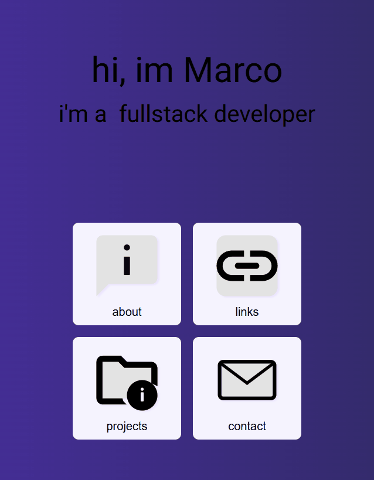

# Portfolio

## Summary

- [Technologies](#technologies)
- [Capabilities](#capabilities)
  - [Multi window management](#multi-window-management)
  - [Proxy based on browser locale](#proxy-based-on-browser-locale)
  - [Theme based on browser preferences](#theme-based-on-browser-preferences)
    - [Light theme](#light-theme)
    - [Dark theme](#dark-theme)
  - [Responsive layout](#responsive-layout)
  - [Static image from Next](#static-image-from-next)
  - [Background calculated animation](#background-calculated-animation)

### Technologies 
 - Build with Next 16
 - Sass (Scss)
 - SSR (Server side render)
 - Next Router (Routes)

    <a href="#top">Back to top</a>

### Capabilities

#### Multi window management
 - State controls properties from window like:
    - Position
    - Controls visual from window to animation purpose
        - Open
        - Openning
        - Close
        - Closing
    - Focus
    - Z-Axis change on window focus
    - Drag

    <a href="#top">Back to top</a>

#### Proxy based on browser locale
 - Redirect to proper route (/en_US or /pt_BR)
 - Individual translate lazy load

    <a href="#top">Back to top</a>

 
#### Theme based on browser preferences
 - Pure css animation

    <a href="#top">Back to top</a>

##### Light theme

    <a href="#top">Back to top</a>

##### Dark theme

    <a href="#top">Back to top</a>

#### Responsive layout
 - Swap dragable window for bottomsheet and drop the multi window in smaller screens.

    <a href="#top">Back to top</a>

#### Static image from Next
 - All images are served as static with Next
 - All images are cached with Next

    <a href="#top">Back to top</a>

#### Background calculated animation
 - Values based on viewport
 - Scss function calculate based on how many colors background will have (minimun of 3)

    <a href="#top">Back to top</a>

